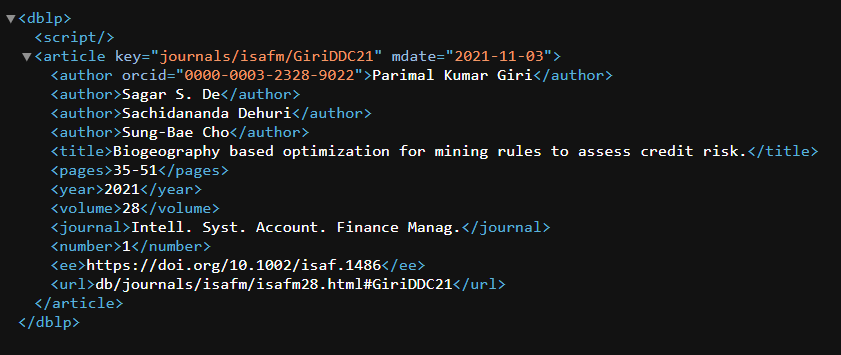

# SD6103 Project

|  |
|:--:|
| <b>[Link](https://dblp.uni-trier.de/rec/journals/isafm/GiriDDC21.xml)</b> - [SD6103 Project](#sd6103-project)

## 1. Table of Contents
- [SD6103 Project](#sd6103-project)
  - [1. Table of Contents](#1-table-of-contents)
  - [2. Installations](#2-installations)
  - [3. Usage](#3-usage)
    - [3.1. Scripts](#31-scripts)
    - [3.2. Downloading and Preparing dataset](#32-downloading-and-preparing-dataset)
    - [3.3. Parsing and extracting the xml data to a csv](#33-parsing-and-extracting-the-xml-data-to-a-csv)
    - [3.4. Split and Combine](#34-split-and-combine)
    - [4. Configuration](#4-configuration)
    - [5. References](#5-references)

## 2. Installations

Code execution is prepared and managed using Python. Set up your own preferred local virtual environment, or use the format below:

Run the following in the file directory containing the cloned repository.
```
# set up venv
python3 -m venv .venv

# activate environment
source .venv/bin/activate # mac
.venv/Scripts/activate # windows

# install python dependencies
pip install -r requirements.txt

# freeze dependencies
pip freeze > requirements.txt
```

## 3. Usage
Python modules are stored in [src](src/). Make sure you're in the root directory of the folder when executing the following commands in the terminal. Before running the modules below, do review the `config.yml` file to ensure the parameters are accurate. For more information on configuration, scroll down to [4. Configuration](#4-configuration).

### 3.1. Scripts
- `download_prepare.py`: execute downloading and preparing of raw dataset
- `dblp_parser`: utility parsing functions 
- `execute_parser`: execute parsing from `dblp_parser`
- `split.py`: split one larger dataset into multiple smaller files
- `combine.py`: combine multiple data smaller data sets into one

### 3.2. Downloading and Preparing dataset
If you have not downloaded the datasets, execute the `download_prepare.py` module
```
python3 src/extract.py

# or run it as a module
python3 -m src.extract
```

You will see 3 new items in your *root* directory - `dblp.dtd`, `dblp.xml` and `dblp.xml.gz`. For directory organisational purposes, you should place the data artifacts in a separate folder. E.g. `artifacts/`. 

### 3.3. Parsing and extracting the xml data to a csv

Once you have the dblp dataset successfully downloaded, you can continue to parse and extract the xml data. 

```
python3 src/execute_parser.py
```

Note that this step takes some time and will use up quite abit of RAM so be prepared for your machine to slow down when executing the commands below.

### 3.4. Split and Combine

Due to the large file size of the dblp file, it will be not feasible to upload the entire dataset directly as it is.

`split.py` is used to split the parsed dataset into smaller files of 100,000 rows each, with the files labelled as `dblp_<number>.csv`. E.g. dblp_1.csv, dblp_2.csv etc.

`combine.py` can be used to join the dataframes back together. Run the following command in your terminal to combine the split datasets into a single big file
```
python3 src/combine.py
```

### 4. Configuration

To simplify the execution of scripts, parameters for calling the modules can predefined using [config.yml](config.yml). 

**execute_parser**
- `dblp_path`: path where your dblp datasets are stored at
  ```
  # this is the path where your dblp datasets are stored at. 
  dblp_path: "<dblp_path>/dblp.xml"
  dblp_path: "artifacts/dblp.xml" # if the files are in the artifacts subfolder
  dblp_path: "dblp.xml" # if the files are in the root folder
  ```
- `csv_save_path`: path where you want the output csv files to be written to

**split**
- `csv_save_path`: path where parsed csv file is stored at
- `rows_each`: number of rows to be split in each of the smaller files 

**combine**
- `read_path`: path where split csv files are stored at
- `output_path`: path where combined dataset to be written to

### 5. References

- [dblp_parser](src/dblp_parser.py) - dblp parser script is referenced from [angelosalatino](https://github.com/angelosalatino/dblp-parser) with some slight adaptions. Namely the `DBLP.parse_all()` method uses the `pandas.concat()` instead of the deprecated `frame.append()` to improve efficiency. Iteratively appending rows using the `frame.append()` method can be more computationally intensive than a single concatenate. The adaption creates an empty list and appends new dataframes to the list, and then concatenate the list of dataframes all at once. A progress tracking output is also added for logging to indicate progress state.
- [splt csv](src/split.py) - the csv split script is referenced and adapted from [kelvintaywl](https://gist.github.com/kelvintaywl/37dbfaea789707ec5f48#file-split-py)


### E/R diagram
Use [erd-go](!https://github.com/kaishuu0123/erd-go/) to draw the E/R diagram, run this:
```shell
cat src/Pub.er | erd-go | dot -Tpng -o assets/Pub-ER.png
```
Note: You use VsCode plugin `ERD Syntax Highlighting` to highli